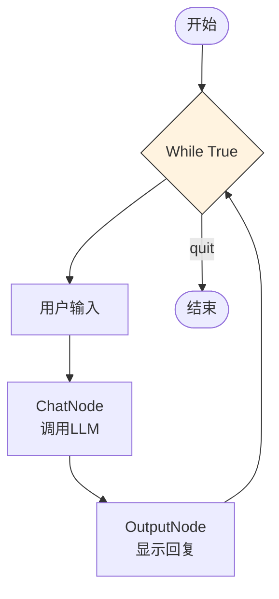

# Simple Chatbot - 简单对话机器人

最基础的对话机器人示例，演示 Node 和 Flow 的基本用法。

## 功能

- 接收用户输入
- 调用 LLM 生成回复
- 维护对话历史

## 架构



## 运行

```bash
python main.py
```

## 代码结构

```
chatbot/
├── README.md
└── main.py
    ├── ChatNode      # 调用 LLM 生成回复
    └── OutputNode    # 输出结果到控制台
```

## Node 说明

### ChatNode

- **输入**: 用户消息（从 shared["messages"] 读取）
- **处理**: 构建 prompt，调用 LLM
- **输出**: LLM 生成的回复

### OutputNode

- **输入**: ChatNode 的输出
- **处理**: 格式化并打印
- **输出**: 无（直接打印到控制台）

## 示例对话

```
👤 You: 你好
🤖 Assistant: 你好！很高兴见到你，有什么我可以帮助你的吗？

👤 You: 什么是Python？
🤖 Assistant: Python是一种高级编程语言...
```

## 关键代码

```python
# Node 定义
class ChatNode(Node):
    def exec(self, payload):
        messages = shared.get("messages", [])
        prompt = self._build_prompt(messages)
        response = call_llm(prompt)
        return "default", response

# Node 连接
chat = ChatNode()
output = OutputNode()
chat >> output  # ChatNode -> OutputNode

# 运行
flow = Flow(chat)
flow.run(None)
```
