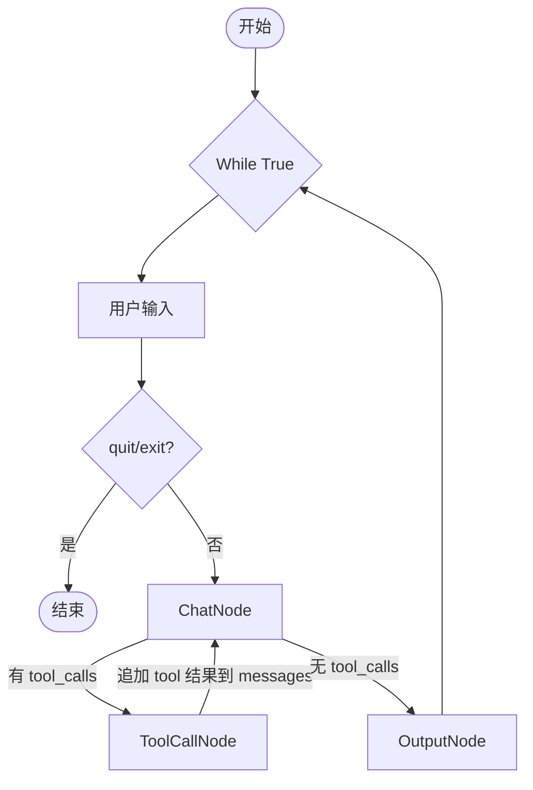

# Chatbot with Tools - 带工具调用的对话机器人

基于 `examples/chatbot` 扩展，增加了工具调用能力。

## 功能

- 接收用户输入
- LLM 决定是否调用工具（`tool_calls`）
- `ToolCallNode` 执行工具并将结果写回上下文
- LLM 基于工具结果生成最终回复
- 支持 `search` 工具进行联网信息查询

## 架构



## 文件结构

```text
chatbot_with_tools/
├── README.md
└── main.py         # ChatNode + ToolCallNode + OutputNode
```

## 运行

```bash
uv run python main.py
```

## 可用工具

- `read`, `write`, `edit`, `bash`, `grep`, `find`, `ls`, `search`

其中 `search` 用于联网检索最新信息；`read/grep/find/ls` 用于本地代码与文件查询。

## 关键流程说明

1. `ChatNode` 调用 `core/llm.py`，传入 `messages + tools + system_prompt`
2. 若返回含 `tool_calls`，流转到 `ToolCallNode`
3. `ToolCallNode` 使用 `ToolExecutor` 解析并执行工具，结果写回 `messages`
4. 回到 `ChatNode` 二次调用模型，生成最终自然语言回复
5. `OutputNode` 打印结果

## 与 `chatbot` 的主要区别

1. 新增 `ToolCallNode`，负责解析并执行 tool calls。
2. 复用 `core/llm.py` 的统一调用入口，支持 `tools` 参数并返回 assistant message。
3. `ChatNode` 不再拼接纯文本 prompt，而是直接传递 `messages` 给模型。
4. 通过 `tools` 模块接入统一内置工具与执行器。
