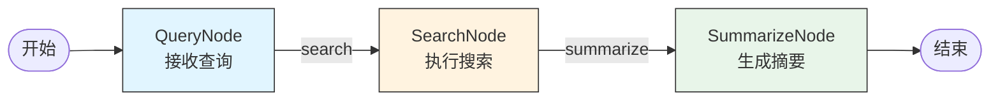
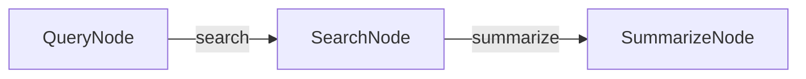
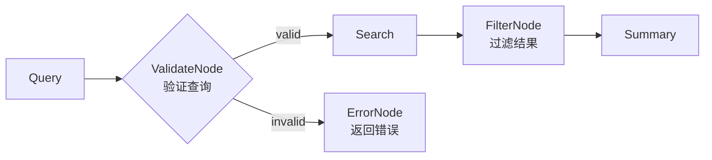

# Workflow - 工作流示例

演示多节点协作的搜索工作流模式。

## 架构



## 功能

1. **QueryNode**: 接收用户查询，决定路由
2. **SearchNode**: 执行搜索，获取网页结果
3. **SummarizeNode**: 基于搜索结果生成一句话摘要

## 运行

```bash
python main.py
```

## 示例输出

```
Workflow 输出：Python asyncio 是用于编写并发代码的标准库，使用 async/await 语法，适合处理 I/O 密集型任务如网络请求和文件操作。
```

## 代码结构

```
workflow/
├── README.md
├── __init__.py
└── main.py
    ├── QueryNode      # 查询接收
    ├── SearchNode     # 搜索执行
    └── SummarizeNode  # 结果总结
```

## Node 详解

### QueryNode

```python
class QueryNode(Node):
    def exec(self, payload):
        # 直接转发到搜索节点
        return "search", str(payload)
```

- **输入**: 用户查询字符串
- **输出**: 路由到 "search"

### SearchNode

```python
class SearchNode(Node):
    def exec(self, payload):
        results = search_ddgs(str(payload), max_results=3)
        titles = [r.get("title") or r.get("body") or "" for r in results]
        summary_input = " | ".join([t for t in titles if t])
        return "summarize", summary_input
```

- **输入**: 查询字符串
- **处理**: 搜索并提取标题
- **输出**: 拼接的标题字符串，路由到 "summarize"

### SummarizeNode

```python
class SummarizeNode(Node):
    def exec(self, payload):
        prompt = f"基于以下要点写一句话摘要：{payload}"
        text = call_llm(prompt)
        return "default", text
```

- **输入**: 搜索结果（标题列表）
- **处理**: 调用 LLM 生成摘要
- **输出**: 最终答案

## 节点连接

```python
# 创建节点
query = QueryNode()
search = SearchNode()
summarize = SummarizeNode()

# 连接
query - "search" >> search      # query 的 "search" 路由到 search
search - "summarize" >> summarize  # search 的 "summarize" 路由到 summarize

# 创建工作流
flow = Flow(query)
```

对应流程图：



## 完整数据流

```
User: "python asyncio best practices"
  ↓
QueryNode: 接收 "python asyncio best practices"
  ↓ "search"
SearchNode: 搜索 → 获取3个结果 → 拼接标题
  ↓ "summarize"
SummarizeNode: LLM 生成摘要
  ↓ "default"
Result: "Python asyncio 是用于..."
```

## 扩展建议

可以在此基础上添加更多节点：



例如：
- **ValidateNode**: 检查查询是否合法
- **FilterNode**: 过滤低质量结果
- **CacheNode**: 缓存搜索结果
- **MultiSourceNode**: 同时搜索多个来源
